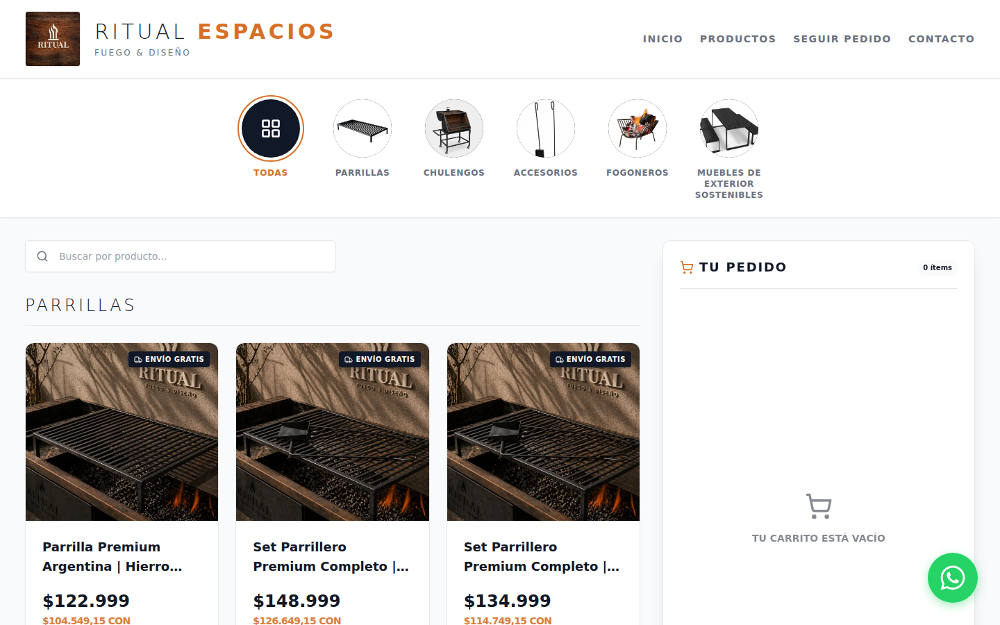
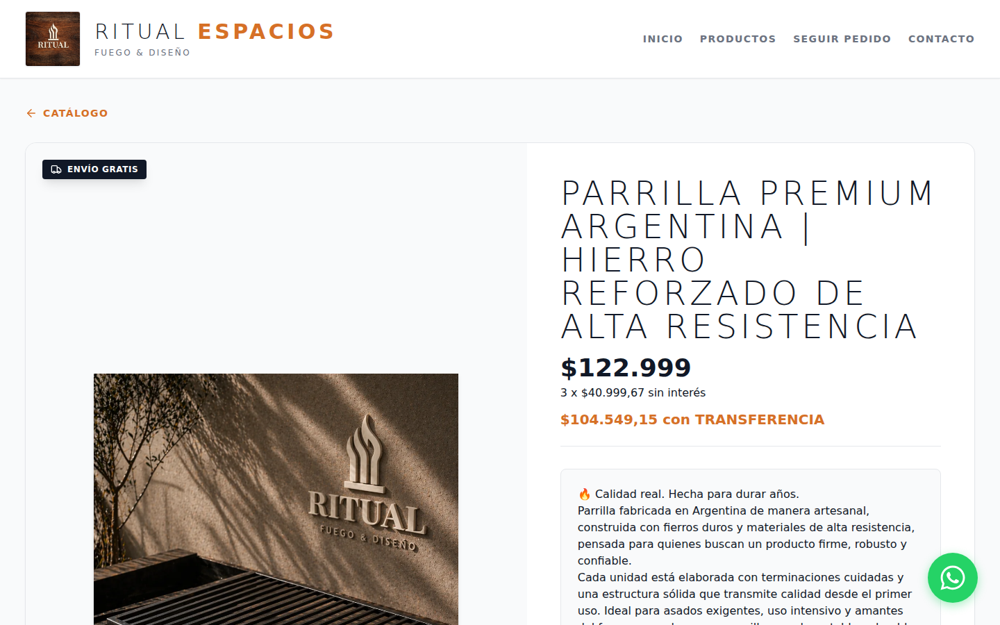

# Ritual Espacios — E-Commerce & ERP Platform

[](https://github.com/Marcovf9/fabrica-ecommerce/actions/workflows/ci.yml)

End-to-end e-commerce and enterprise resource planning (ERP) platform built to order for **Ritual Espacios**, a manufacturer of sustainable outdoor furniture and wrought-iron structures.

The system covers the full retail sales flow, payment automation and an advanced admin panel for physical inventory control, order traceability, size-variant management and profitability analysis.

## 📸 Screenshots

<!--
  Generate the images from production with:
    cd frontend
    npm i --no-save playwright && npx playwright install chromium
    ADMIN_USER=... ADMIN_PASS=... npm run screenshots
  They are saved to docs/screenshots/. Commit them and delete the comment markers around this table.

| Storefront | Catalogue |
|---|---|
|  |  |
| **Product detail (size variants)** | **Admin panel / ERP** |
|  |  |

<p align="center"></p>
-->

Live site: **[ritualespacios.com](https://ritualespacios.com)**

## 🏗 System Architecture

The project is split into two independent applications that communicate through a secured RESTful API.

### Frontend (Storefront and Admin Panel)
- **Framework:** React.js with TypeScript (bundled with Vite).
- **Styling:** Tailwind CSS for a fluid, responsive, *mobile-first* design.
- **Charts:** Recharts for financial metrics visualisation.
- **State management:** Context API / LocalStorage for cart persistence, even after payment interruptions.
- **Alerts and UI:** SweetAlert2 for modals and data handling, Lucide React for iconography.
- **SEO & tracking:** JSON-LD (Schema.org) implementation, Open Graph tags and native readiness for Meta Pixel and Google Analytics 4.

### Backend (Business Core and API)
- **Framework:** Java 21 + Spring Boot 3.
- **Security:** Spring Security with JWT token-based authentication.
- **Payment gateway:** Native integration with the **Mercado Pago** SDK (Preference API & Webhooks).
- **Database:** MySQL hosted in the cloud via TiDB.
- **Migrations:** Flyway for strict database schema control.
- **ORM:** Hibernate / Spring Data JPA.
- **File storage:** Cloudinary API integration for optimised photo hosting via `multipart/form-data`.
- **Document generation:** iTextPDF for dynamic delivery-note generation.
- **Communications:** JavaMailSender for automated transactional emails (admin alerts and customer notifications).

## 🚀 Key Features

1. **Automated checkout with Mercado Pago:** Integrated payment flow with automatic redirection and *webhook* (IPN) processing to confirm payments and update order status in real time.
2. **Email notification system:** Automatic dispatch of formatted HTML emails to confirm purchases, shipments and cancellations, and to send critical stock alerts to the admin team.
3. **Fine-grained inventory management:** Physical stock control segmented by product ID and size variant, with automatic frontend blocking when stock runs out (dynamic Quick Select).
4. **Financial dashboard and ERP:** Protected admin panel that calculates revenue, production costs (by batch) and net profit margin in real time.
5. **Cart recovery:** Silent capture (`onBlur`) of emails and phone numbers to log abandoned purchase attempts and manage leads.
6. **Order status handling:** Strict audit flow (PENDING → PAID → SHIPPED / CANCELLED), with direct impact on stock and options to delete test records.
7. **Dynamic catalogue management:** Real-time product creation, editing, price updates and photo replacement from the control panel.

## ✅ Tests and CI

The backend tests cover the business-critical paths:

- **Mercado Pago webhook** (`MercadoPagoWebhookTest`): only an `approved` payment for a `PENDING` order confirms it; rejected payments, duplicate notifications, unknown references, non-payment topics, malformed payloads and MP API failures are ignored without breaking the IPN response.
- **Per-variant stock control** (`OrderServiceStockTest`): FIFO consumption of inventory batches of the purchased size only, cost-of-goods calculation, `InsufficientStockException` when a size runs out, idempotent confirmation, and stock restored to the original batches when an order is deleted.
- **Batch repository** (`InventoryBatchRepositoryTest`): the per-size availability query on a real (H2) database.

Tests run against an in-memory H2 database (`test` profile), so no MySQL or external credentials are needed:

```bash
cd backend && ./mvnw test
```

GitHub Actions (`.github/workflows/ci.yml`) runs the backend tests and the frontend typecheck + build on every push to `develop` or `main` and on every pull request.

## 🌍 Production Environment and Deployment

The infrastructure is fully cloud-hosted and secured over HTTPS:
- **Official domain:** [ritualespacios.com](https://ritualespacios.com) (managed via GoDaddy DNS).
- **Frontend hosting:** Netlify (global CDN with strict TypeScript auditing).
- **Backend hosting:** Render (web services for the API and webhook processing).
- **Database:** TiDB Cloud.
- **Media CDN:** Cloudinary.

## ⚙️ Running Locally (Development)

**Backend:**
1. Set the environment variables in `application.properties` (TiDB credentials, Cloudinary, JWT secret, Mercado Pago access token, mail credentials).
2. Run `./mvnw clean install` to download dependencies and run the tests.
3. Start the Spring Boot server (`http://localhost:8080`). Flyway will automatically create the tables and base users.

**Frontend:**
1. Navigate to the web client folder.
2. Run `npm install`.
3. Start the Vite development server with `npm run dev`.
4. The frontend will consume the API from the port configured in `.env` (`VITE_API_URL`).
